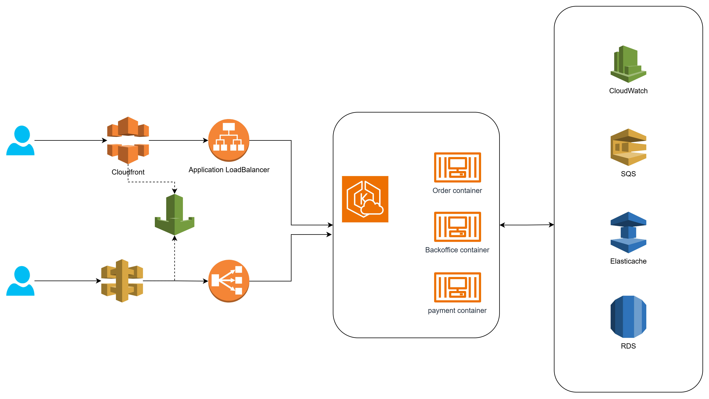

Provide your solution here:

Auto Scaling:
    Compute: ECS/EKS clusters are configured with auto-scaling policies based on CPU, memory usage, or custom CloudWatch metrics (e.g., request latency, queue length).
    Database & Cache: Aurora and ElastiCache are designed to scale horizontally (Aurora via read replicas; ElastiCache via clustering) when needed.